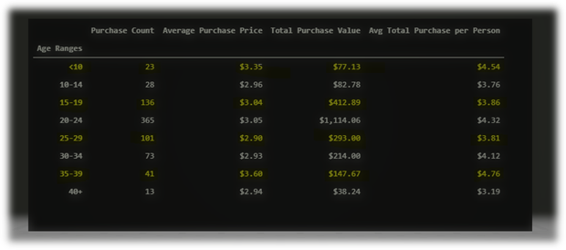
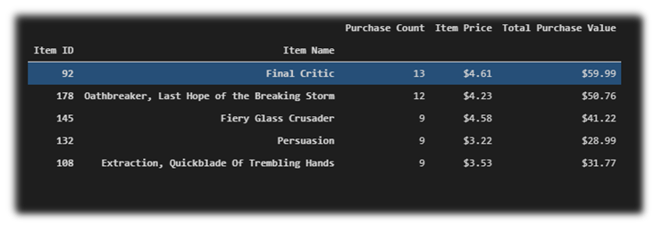
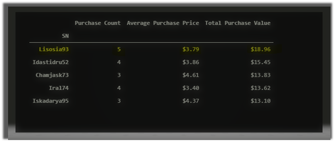
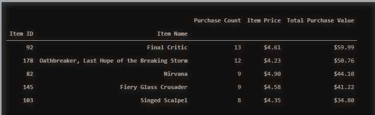

# Heros-Of-Pymoli

Summary of Data

Player Count

  There are 576 active players, some players making multiple purchases. 

Purchasing Analysis (Total)

 	There are 179 unique items.
 	The average purchase price is at $3.05.
 	The is a total of 780 purchases.
 	The total revenue came in at $2,379.77

Gender Demographics

 	484 players are Male which is 84.03% of the total number of players.
 	81 players are Female which is 14.06% of the total number of players.
 	11 players are Other /NON-Disclosed which is 1.91% of the total number of players.

Purchasing Analysis (Gender)

 	Males made 652 purchases with and average purchase prices of $3.02 totaling $1,967.64 in revenue. Male players spent an average of $4.07 in total.
 	Females made 113 purchases with and average purchase prices of $3.20 totaling $361.94 in revenue. Female players spent an average of $4.47 in total.
 	Other /NON-Disclosed players made 15 purchases with and average purchase prices of $3.35 totaling $50.19 in revenue. These players spent an average of $4.56 in total.
 
Purchasing Analysis (Age)
________________________________________________
  

Most Popular Items
_________________________________________________
  

Top Spender
__________________________________________________
  
  
 Most Profitable Items 
  ________________________________________________
  !
